# MERN Stack
## Step 1:
## Launch and Connect to EC2
### (a) Launch the EC2 instance

* Launch an EC2 instance: search ec2 - click launch instance - Name the instance (Ecommerce-sever) - select Amazon linux as AMI OS - instance type (t3 micro free tier) - create new key pair and download - setup security group - launch instance.

Below shows the instance in running state
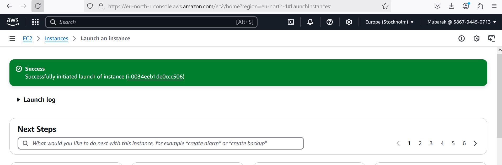

### (b) Connect to the EC2 instance through ssh: 
 Once my instance started running, I connected to it from my local machine using ssh by running the command - **ssh -i "C:\Users\user\Documents\MY_PBL\MERN-ec2\MERN-ec2.pem" ec2-user@13.51.237.162**. The result is shown below
 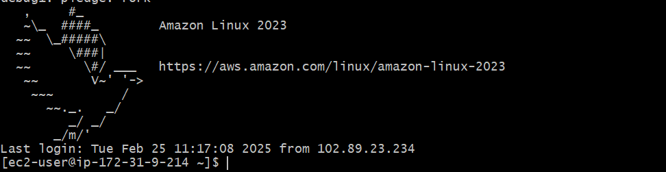

 ## **Step 2: Install node.js and MongoDB**

 ### **Reason for step 2:** 
 Step 2 is crucial because Node.js and MongoDB are fundamental components of the MERN stack, and without them, your application cannot function properly.

 ### **Installing node.js, What it does:**
 * **Node.js** is a JavaScript runtime that allows you to run JavaScript code outside the browser. It is essential for executing the backend server (Express.js) in the MERN stack. It allows JavaScript to handle requests, process data, and communicate with MongoDB.

* **npm (Node Package Manager)**, which comes with Node.js, is used to install dependencies like Express, Mongoose, and other backend packages.

Think of Node.js as the engine that powers your MERN app’s backend (server-side code). Imagine you have a car (your web application), but no engine. Without an engine (Node.js), your car cannot run. Without Node.js, your backend cannot process requests, handle user logins, or even connect to MongoDB.

### **What Node.js does in my MERN app**
Node.js is the backend engine that allows your MERN app to function. Without it, your app is just an empty shell.
* Runs JavaScript code outside the browser (on the server).
* Powers Express.js, the backend framework that handles requests (e.g., login, sign-up).
* Uses npm (Node Package Manager) to install packages (e.g., Express, Mongoose, CORS).
* Talks to MongoDB to store and retrieve data.

### **Installing MongoDB, What it does:**
* **MongoDB** is a NoSQL database used to store and manage application data.
* It allows your application to store, retrieve, and manage user data (e.g., user accounts, products, orders).
* It works well with JavaScript and JSON, making it ideal for MERN applications.

Think of MongoDB as a giant notebook where your app writes down important information (user details, product info, orders, etc.). Imagine a store with no record book. You sell products, but you don’t write down customer orders. Without MongoDB, your app forgets everything when you close it!

#### **What Node.js does in my MERN app**
* Stores user details (like name, email, passwords).
* Saves product info, orders, messages, etc.
* Sends data back to your app when requested.

### **One last Analogy**
Imagine a fast food restaurant
* **Node.js** = The chef who prepares and serves orders.
* **MongoDB** = The order book that stores all customer orders.

Without Node.js, orders can’t be processed. Likewise without MongoDB, orders are forgotten after a customer leaves. That’s why we need both Node.js and MongoDB to run the MERN stack! 🚀

### **Node.js Installation**
  Since I am  using Amazon Linux 2023, which is based on Fedora/RHEL rather than Debian/Ubuntu. In Amazon Linux, apt is not available because it uses dnf (or yum in older versions) as the package manager.

* Next step is to first update the system using - **sudo dnf update -y**
* Then install node.js using the command **sudo dnf install -y nodejs**
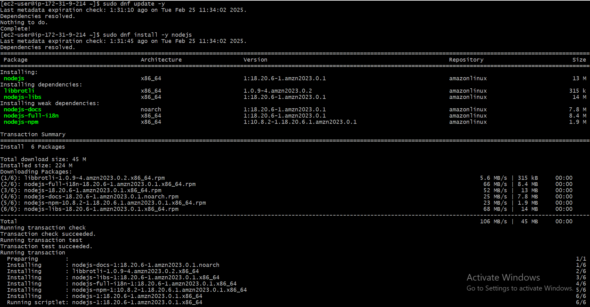

* Check the version installed using **node -v** and **npm -v**
This is shown below
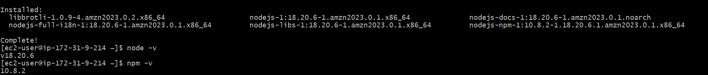

### **MongoDB Installation**
Before installing MongoDB, you first need to add the mongoDB repository. A repository (repo) in linux is like a warehouse that contains software packages that you can download and install using package managers (like dnf or yum in Amazon Linux). Think of it like an app store or playstore of linux. When you install an app on your phone, you download it from Google Play Store or Apple App Store. In Linux, when you install software, you download it from a repository (repo).

**Amazon Linux** doesnt come with MongoDB by default. If you try to install MongoDB using **dnf install mongodb**, it won’t work because Amazon Linux doesn’t know where to find it. You need to tell your system where to find MongoDB by adding MongoDB’s official repository. Once added, Amazon Linux can fetch MongoDB from this repo whenever needed.

* Create a new repository file for mongoDB - **sudo vi /etc/yum.repos.d/mongodb-org-7.0.repo**

* Paste the following repo configuration inside the file, also image shown below:
#### [mongodb-org-7.0]
#### name=MongoDB Repository
#### baseurl=https://repo.mongodb.org/yum/amazon/2023/mongodb-org/7.0/x86_64/
#### gpgcheck=1
#### enabled=1
#### gpgkey=https://pgp.mongodb.com/server-7.0.asc

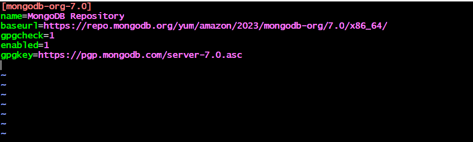

* Now i can install MongoDB using **sudo dnf install -y mongodb-org** as shown below
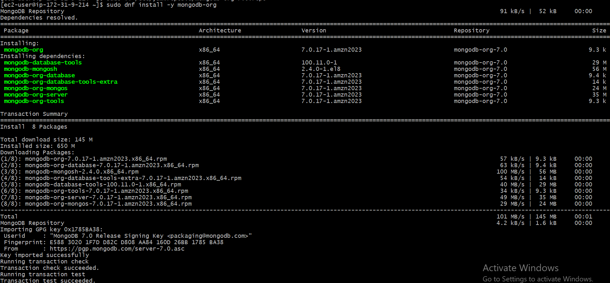

* Start MongoDB on boot - **sudo systemctl start mongod**
* Enable MongoDB on boot - **sudo systemctl enable mongod**
* Verify MongoDB is running - **sudo systemctl status mongod**
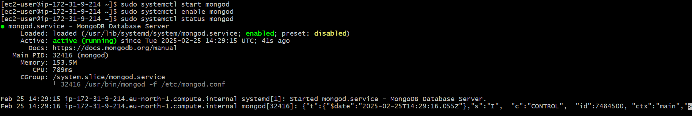

## **Step 3: Clone the remote repository**
* Since i will be using git commands here, I need to first install git before cloning. install git using **sudo yum install git** as shown below
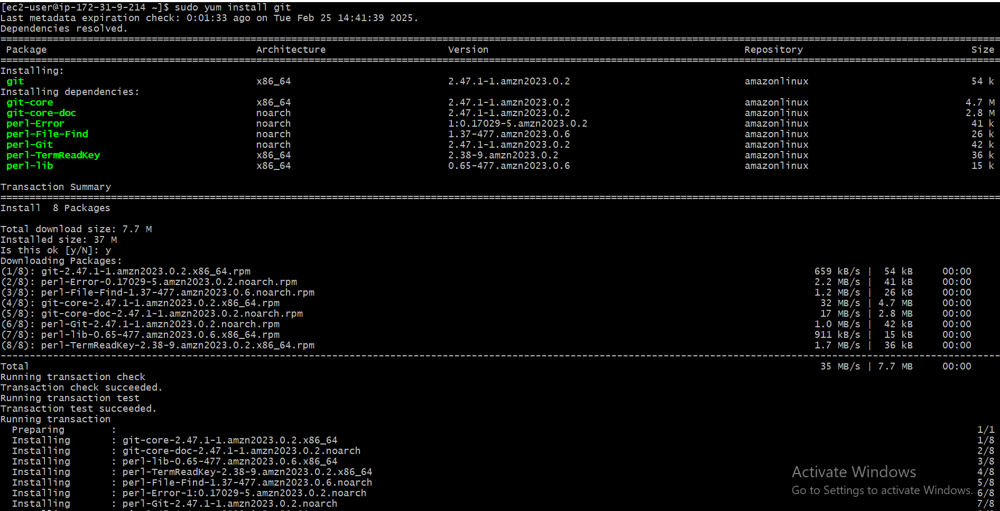

* Then clone into my remote repository using - **git clone https://github.com/olamidey-io/MERN-project.git**

* Then change directory into the project using - **cd MERN-project**
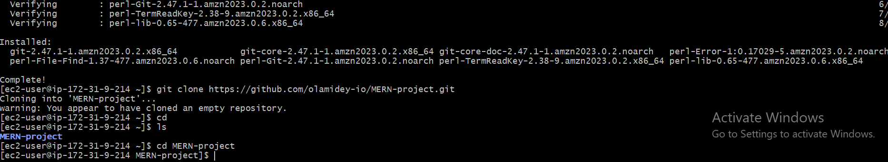

## **Step 4: Install backend dependencies**

The package.json file is very important as it defines your project (name, version, description, author, etc.). It also tracks dependencies (express, mongodb, dotenv, etc.), so others can install them with npm install. It stores scripts (e.g., "start": "node index.js" to run your app). 

Now, when you install dependencies, another file called package-lock.json is created. It locks the exact versions of each package so that you get the same setup every time you install. This prevents issues where one developer gets a different version than another. You don’t need to manually edit package-lock.json—it’s automatically generated when you install dependencies.

#### **Imagine you are baking a cake:**
You need a recipe that lists all the ingredients (flour, sugar, eggs) and how to use them. The recipe ensures that you always use the right ingredients in the right amounts.

 In Node.js projects, package.json is your recipe. It lists all the ingredients (dependencies) your project needs. It helps Node.js install everything correctly so your backend works.

 #### **Dependencies and what they do**

 * <u>**Express**</u>: The framework that handles server requests (like a waiter in a restaurant 🍽️).
 * <u>**Mongoose**</u>: Allows Node.js to talk to MongoDB (like a translator 📞).
 * <u>**Cors**</u>: Allows different web apps to communicate (prevents security issues 🔒).
 * <u>**dotenv**</u>:Lets you store secret keys and passwords securely 🔑.
 * <u>**mongodb**</u>: a node.js driver that helps you connect to the database

 ### **Final Analogy**
 * **package.json** = Recipe 📜 (Lists the ingredients you need)
 * **package-lock.json** = Receipt 🧾 (Ensures the exact same versions are used)
 * **Dependencies** = Ingredients 🥚🧂 (Tools your app needs to work)
 * **npm install** = Grocery Shopping 🛒 (Brings all the tools into your project)

 ### **Installation**
 * First thing is to verify that package.json file is in your directory using - **ls -la**. It cannot be there as this is a new project, evidence shown below:
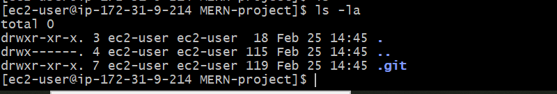

* Since the file is missing, then manually add it by running **npm init -y** to create the file with some basic fields as shown below
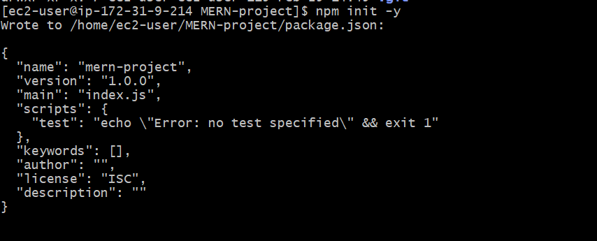

* And then install the dependencies using **npm install cors dotenv express mangoose mongodb** as shown below
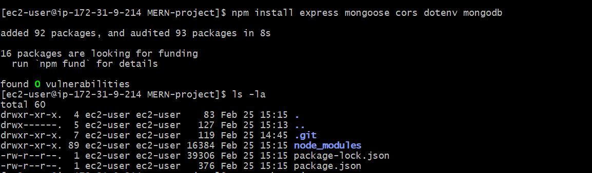.

* The content of package.json file is listed using **cat package.json** as shown below
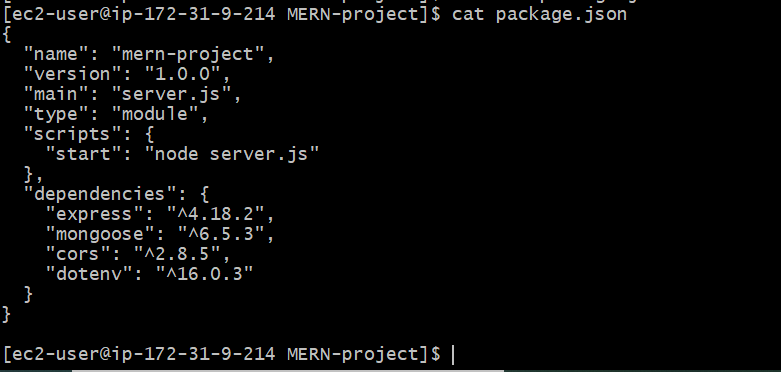

It is also shown on a vi editor as shown below:
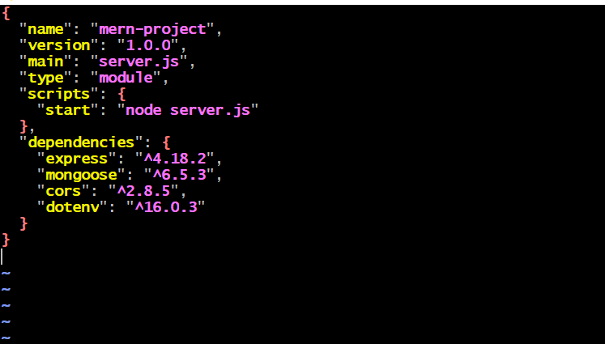

## **Step 5: Setting up the .env file**
The next step is creating a **.env** file to store your MongoDB connection string securely. A **.env** file is where you store secret or environment-specific values (like database URLs, API keys, etc.) instead of hardcoding them into your code. The .env file is like a secret notepad for your project. It stores important values that your app needs to work but should NOT be shared with others. 

### **Break down of MongoDB connection string**

The connection string looks like what we have below:
**MONGO_URI=mongodb://127.0.0.1:27017/mydatabase**

This contains three key parts which are:

*  **127.0.0.1 → The Server Address (Localhost)**: This tells your backend where to find MongoDB. **127.0.0.1 (or localhost)** means the database is running on the same server as your backend. If MongoDB was hosted elsewhere (e.g., MongoDB Atlas), you'd use a different address. Without this? Your backend won’t know where to connect!

*  **27017 → The Port**: A port is like a "door" or virtual communication point that allows communication between your computer and the internet. MongoDB listens for connections on port 27017 by default. When your backend wants to talk to MongoDB, it sends requests to this port. Without this? Your backend won’t reach MongoDB because it won’t know which "door" to knock on!

To check if mongoDB is running on the default port, run - **sudo netstat -tulnp | grep mongod** as shown below:
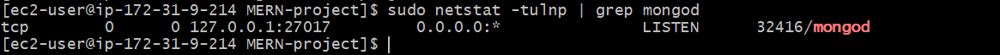

* **mydatabase → The Database Name**: This is the actual database where your app stores data (e.g., users, orders, etc.). If this database doesn’t exist, MongoDB will automatically create it when you insert data. Without this? Your backend wouldn't know which database to store/retrieve data from!

To get the database name, login to the mongoDB shell using **mongosh**, then **show dbs**. if no database name is listed, create a new database name using **use MERN-databse**. Then insert a sample data - **db.users.insertOne({ name: "Olamide", email: "ibrahimolamide999@gmail.com" })**. Then verify again if database name now exits by running **show dbs**
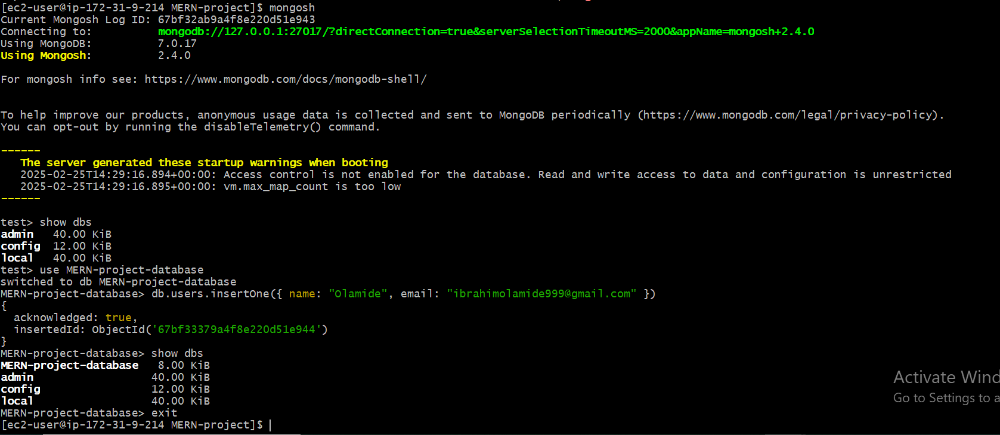

Then there is a second line in the **.env** file which is **PORT=5000**. Defines the port on which your backend (Node.js + express) will run to handle API requests. It ensures your backend runs on a specific port so that your frontend or API clients can access it. Frontend (React) Usually runs on port 3000 (serves the UI).

**The .env file is a safe place for storing secrets like:**

* **Database connection (MONGO_URI)** – This is the address where your app can find the MongoDB database to store and retrieve data. If this value is wrong or missing, your app won't be able to connect to the database, meaning users can’t save or load data.
* **API keys (API_KEY)** – This is like a password that lets your app use external services like Google Maps, Stripe (payments), or OpenAI.
* **Ports (PORT)** – This tells your app which "door" (port) to use for communication. Your backend listens for requests on this port. If another program is using this port, your app won't start or users won't be able to access it.
* **Authentication secrets (JWT_SECRET)** – This is used for user authentication (logins, secure access). It helps your app know if a user is really who they say they are. If someone gets this secret, they can log in as ANY user, which is a HUGE security risk!
* **Cloud storage keys (AWS_ACCESS_KEY)** – These are keys that allow your app to store and retrieve files from cloud services like AWS S3 or Firebase. Without these keys, your app won't be able to upload images, videos, or files to the cloud.

Using a .env file protects your sensitive data and makes your app more secure and flexible. 

The **.env** file is shown below:
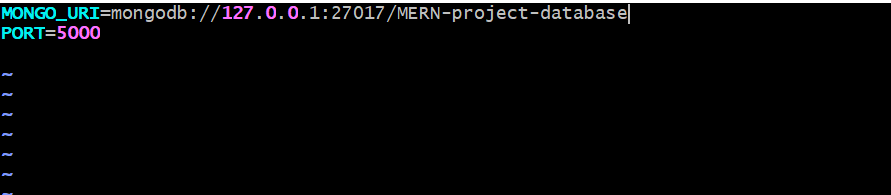

## **Step 6: Modifying the server.js file and starting it**

Think of **server.js** as the brain of your backend. It is the main file that starts your **Node.js** application and connects all the parts together. **Server.js** is the main backend file that connects MongoDB, handles API requests, and starts the server.

A basic **Server.js** file should do five things:

* Import required packages (Express, Mongoose, CORS, dotenv)
* Load environment variables (from .env file)
* Connect to MongoDB
* Set up middleware (CORS, JSON parsing)
* Start the server on a specific port

Using the command - **sudo vi server.js**, i added the code to the file as shown below:

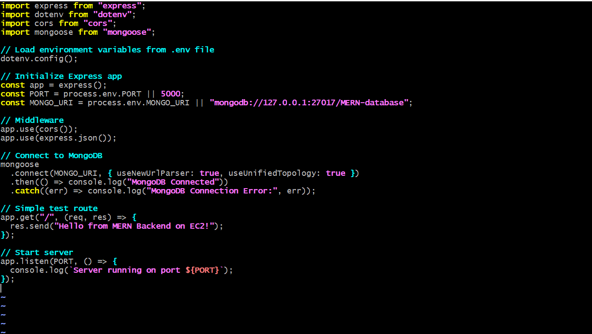

Then i started the server using - **node server.js**. Below is an image showing my server running and mongoDB connecteed!

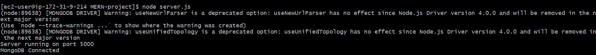

